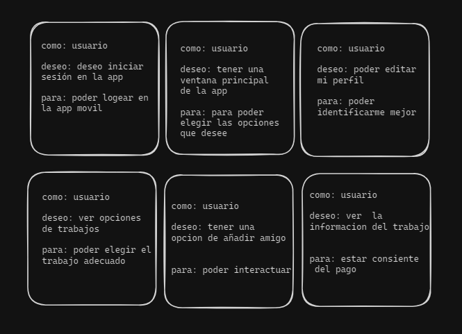
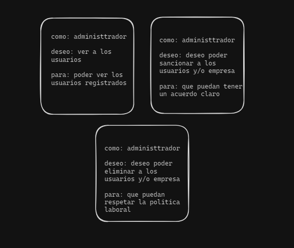
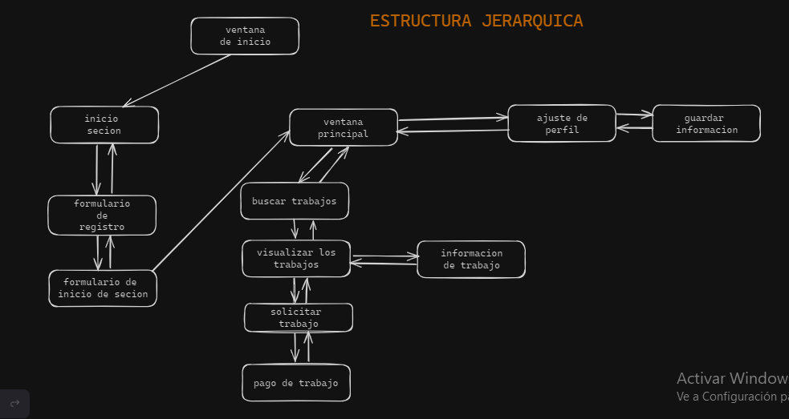

# (TRABAJANDO)
## PROBLEMATICA
en la actualidad la mayoria de las personas  no pueden conseguir un trabajo , tambien en las empresas ay algunos trabajadores que no se desempeñan bien en su empleo
## SOLUCION
que los trabajdores se sientan comodo con sus trabajos que realizan en el dia a dia   , tambien las empresas esten conformes con el desempeño de sus trabajadores 
## ACTORES
Los actores que considere para mi app movil son los siguientes
#### USUARIO
el usuario es el que da un mayor uso de la app movil para que pueda conseguir el trabajo adecuado para el y pueda desempeñarse de manera adecuada y eficiente , contribuyendo haci en la empresa y que no tengan ningun incobeniente en el ambito laboral 
#### EMPRESA
la empresa tambien es como un segundo usuario el cual va  utilizar la app movil para que pueda tener a su dispocision a trabajadores con buenos desempeños laborales en el trabajo  y tambien no tener algunos incomvenientes en el reclutamiento de personal
#### ADMINISTRADOR
el admistrador va ser el que se encarga de que no hayga  un desorden en la hora que hay un reclutamiento de personales para una empresa , tambien hara estrictas encuestas en el cual el  trabajador y la empresa tiene que rellenar de forma obligatoria 
## HISTORIAS DE USUARIO
#### USUARIO

#### EMPRESA

#### ADMINISTRADOR

## MAPA DE NAVEGACION

## DIAGRAMA DE CASOS DE USO
                                                 
## PATRON DE ARQUITECTURA 